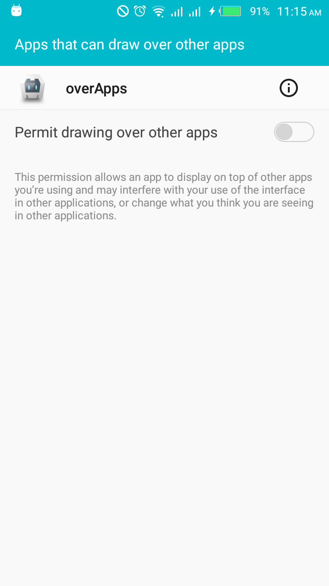
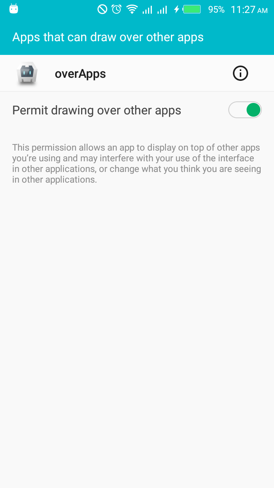
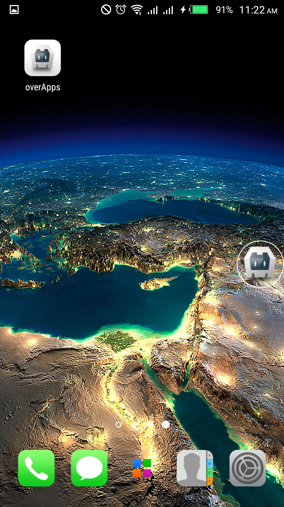
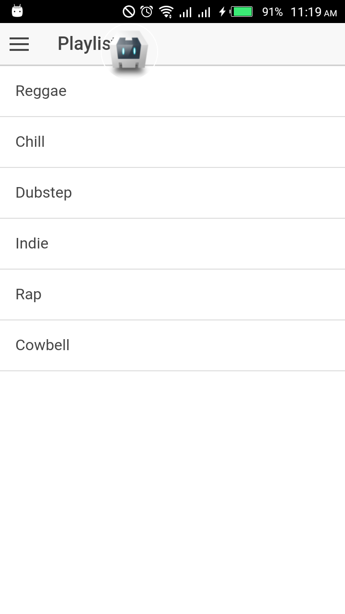
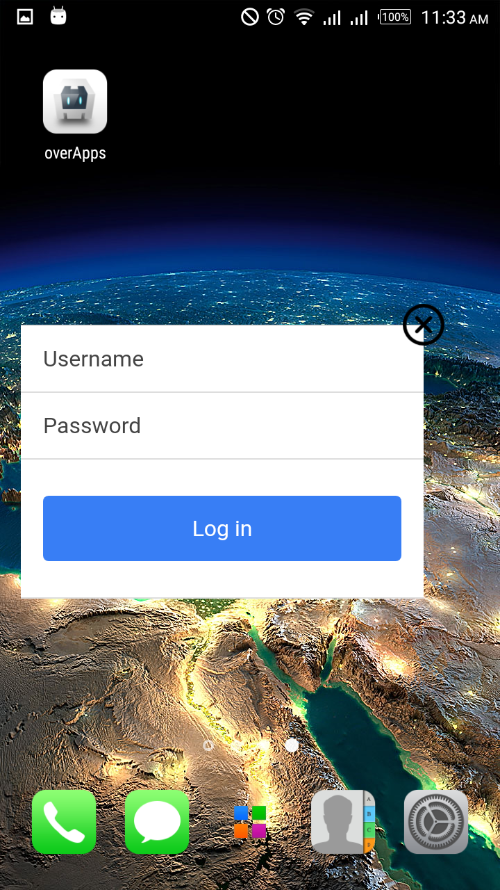

Draw Over All Apps plugin for Cordova
===============================

Android Cordova Plugin that uses draw over all apps feature to display a HTML Web view

This plugin was successfully tested on Android 5.1 , also on Marshmallow (Android 6.0).

## Install  ##

	cordova plugin add cordova-plugin-drawoverapps
It is also possible to install via repo url directly 

    cordova plugin add https://github.com/ahmedwahba/cordova-plugin-drawoverapps
    

    
## Functions

 - window.overApps.checkPermission
 - window.overApps.startOverApp
 - window.overApps.closeOverApp
 
### window.overApps.checkPermission
This to check draw-over-apps permession and open system permission window to be granted  

      window.overApps.checkPermission(function(msg){
             console.log(msg);
      });

|                                    |                                     |
| ---------------------------------  | --------------------------------    |
|| |

### window.overApps.startOverApp

start service function display the over-all head or the web view according to options. If successful the `success` is called,
otherwise the `failed` is called instead.

    window.overApps.startOverApp(options, success, failed);

#### Options

 - **path**: file path to display as view content, this file should be located in  `WWW` root folder.
 - **hasHead**: display over app head image which open the view up on click , by default true.
 - **dragToSide**: enable auto move of head to screen side after dragging stop , by default true.
 - **enableBackBtn**: enable hardware back button to close view, by default true.
    &nbsp;&nbsp;&nbsp;&nbsp;&nbsp;&nbsp;&nbsp;&nbsp;&nbsp;&nbsp;&nbsp;&nbsp;&nbsp;&nbsp;&nbsp;&nbsp;&nbsp;&nbsp;&nbsp;&nbsp;&nbsp;&nbsp;&nbsp;
    should be disabled to be able to use keyboard. 
 - **enableCloseBtn**: whether to show native close btn or to hide it , by default true
 - **verticalPosition**: set vertical alignment of view , values are top - center - bottom , by default center. 
 - **horizontalPosition**: set horizontal alignment of view , values are right - center - left , by default center.

#### Example

    var options = {
          path: "test.html",          // file path to display as view content.
          hasHead: true,              // display over app head image which open the view up on click.
          dragToSide: false,          // enable auto move of head to screen side after dragging stop. 
          enableBackBtn: false,       // enable hardware back button to close view.
          enableCloseBtn: true,      //  whether to show native close btn or to hide it.
          verticalPosition: "top",    // set vertical alignment of view.
          horizontalPosition: "left"  // set horizontal alignment of view. 
     };
     
     window.overApps.startOverApp(options,function (success){
       		console.log(success);
     },function (err){
       		console.log(err);
     });

|                                    |                                     |                                    |
| ---------------------------------  | --------------------------------    | -----------------------------------|
||  ||

### window.overApps.closeOverApp

It closes over app web view , called inside app itself only .

    window.overApps.closeOverApp();

## Control overApp WebView

### Close WebView 

It closes over app webview from one of the webview UI or event  

    OverApps.closeWebView();

## Licence ##

Copyright (c) 2017	Ahmed Wahba & Mohamed Sayed

Permission is here by granted, free of charge, to any person obtaining a copy
of this software and associated documentation files (the "Software"), to deal
in the Software without restriction, including without limitation the rights
to use, copy, modify, merge, publish, distribute, sublicense, and/or sell
copies of the Software, and to permit persons to whom the Software is
furnished to do so, subject to the following conditions:

The above copyright notice and this permission notice shall be included in
all copies or substantial portions of the Software.

THE SOFTWARE IS PROVIDED "AS IS", WITHOUT WARRANTY OF ANY KIND, EXPRESS OR
IMPLIED, INCLUDING BUT NOT LIMITED TO THE WARRANTIES OF MERCHANTABILITY,
FITNESS FOR A PARTICULAR PURPOSE. IN NO EVENT SHALL THE
AUTHORS OR COPYRIGHT HOLDERS BE LIABLE FOR ANY CLAIM, DAMAGES OR OTHER
LIABILITY, WHETHER IN AN ACTION OF CONTRACT, TORT OR OTHERWISE, ARISING FROM,
OUT OF OR IN CONNECTION WITH THE SOFTWARE OR THE USE OR OTHER DEALINGS IN
THE SOFTWARE.
